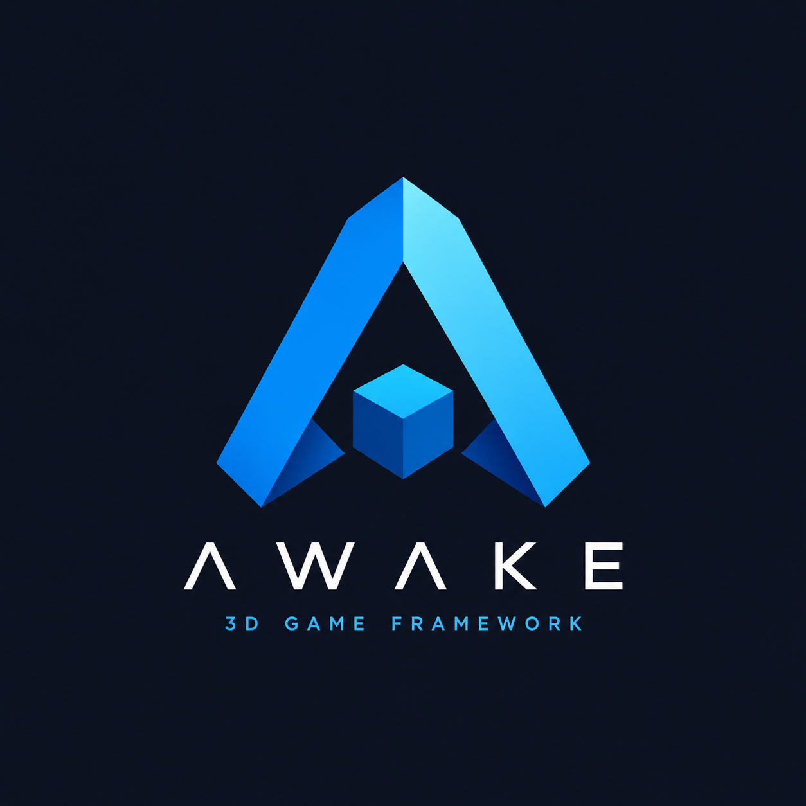

<p align="center">
  
</p>


[](http://kotlinlang.org)
[](https://opensource.org/licenses/Apache-2.0)

# Awake

A Kotlin Multiplatform game engine. Write your game once in `commonMain` and run it on
Android, iOS, Desktop, and the Web.

> **Not published yet.** Build from source. Nothing has shipped to Maven Central.

## What's in it

- **Rendering** — Vulkan on desktop/Android/iOS, WebGPU on the web. Shadows, PBR
  materials, glTF loading with GPU skinning.
- **ECS and scenes** — a sparse-set ECS, a `scene { }` DSL, and scenes authored as JSON
  rather than hand-rolled demo code.
- **UI** — an immediate-mode, shadcn-styled UI stack with ~80 components, built in three
  layers (layout primitives, unstyled widgets, styled design system).
- **Physics** — backend-neutral API, Jolt Physics implementation.
- **Tooling** — asset pipelines instead of hand-authored data: SVG → vector icons, TTF →
  glyph atlas, plus visual regression testing for the UI.

## Try it

```bash
./gradlew :samples:scene3d-playground:run
```

A rotating cube, a glTF viewer, and a skinned-mesh demo, with camera and material
controls. For the web build (Chrome/Edge 113+), run
`:samples:scene3d-playground:wasmJsBrowserDevelopmentRun` and open the printed URL.

Also runnable:

- [`samples/ui-showcase`](samples/ui-showcase) — every UI component in one gallery.
- [`samples/studio`](samples/studio) — a small editor shell: example browser, inspector,
  viewport tools.

Desktop and Web have runnable apps today. iOS and Android build the shared framework/AAR
but don't have app wrappers yet.

## How a game fits together

1. **A `Game`** — your code (`ready`, `render`, optional `resize`/`pause`/`resume`).
2. **An application** — `VulkanGameApplication` or `WebGpuGameApplication`, which builds
   the device/swapchain/pipelines for you.
3. **A scene, optionally** — `sceneGame { }` gives you an ECS world with `Transform`,
   `MeshRenderer`, `Camera`, and `Light`, plus the systems that drive them.

## Modules

All modules are `0.1.0-SNAPSHOT`. ✅ supported · ⚠️ compiles, not functional yet · ❌ not targeted.

| Module                                   | Type    | Status          | 📱 Mobile | 🖥️ Desktop | 🌐 Web | What it does                                       |
|:-----------------------------------------|:--------|:----------------|:---------:|:-----------:|:------:|:---------------------------------------------------|
| [`base`](awake/base)                     | Core    | 🧪 Alpha        |     ✅     |      ✅      |   ✅    | Math, assets, input                                |
| [`ecs`](awake/ecs)                       | Core    | 🧪 Alpha        |     ✅     |      ✅      |   ✅    | Sparse-set ECS runtime                             |
| [`engine`](awake/engine)                 | Runtime | 🧪 Alpha        |     ✅     |      ✅      |   ✅    | Bootstrap and app lifecycle                        |
| [`engine:ui`](awake/engine/ui)           | UI      | 🧪 Alpha        |     ✅     |      ✅      |   ✅    | Immediate-mode UI stack                            |
| [`scene`](awake/scene/README.md)         | Runtime | 🧪 Alpha        |     ✅     |      ✅      |   ✅    | Scene graph and components                         |
| [`physics:api`](awake/physics/api)       | API     | 🧪 Alpha        |     ✅     |      ✅      |   ✅    | Backend-neutral physics contract                   |
| [`backend:vulkan`](awake/backend/vulkan) | Backend | 🧪 Alpha        |     ✅     |      ✅      |   ❌    | Main renderer                                      |
| [`backend:webgpu`](awake/backend/webgpu) | Backend | ⚠️ Experimental |     ❌     |      ❌      |   ✅    | Web renderer                                       |
| [`backend:jolt`](awake/backend/jolt)     | Backend | 🧪 Alpha        |     ✅     |      ✅      |   ⚠️   | Jolt Physics implementation (Web stub only)        |
| [`backend:opengl`](awake/backend/opengl) | Backend | 🧊 Frozen       |     ✅     |      ✅      |   ❌    | The old engine's renderer. Compiles, not wired in. |

## Docs

- [`CHANGELOG.md`](CHANGELOG.md) — what changed
- [`docs/MVP_PLAN.md`](docs/MVP_PLAN.md) — near-term status
- [`docs/reference/developer-docs.md`](docs/reference/developer-docs.md) — build/test/docs workflow
- [`docs/reference/ui-validation.md`](docs/reference/ui-validation.md) — how UI/icon fidelity is
  verified
- [`tools/README.md`](tools/README.md) — asset generators and the parity toolchain

`./gradlew developerDocs` builds the API reference and UI tutorial pages.

## License

[Apache License, Version 2.0](LICENSE).
