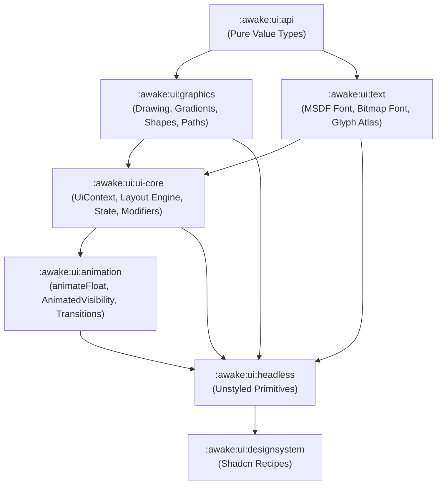

### Awake Graphical User Interface (GUI)

Awake UI is an immediate-mode UI framework for the Awake engine, modeled after modern declarative UI architecture patterns (Jetpack Compose / Base UI).

### Module Architecture

The UI system is decomposed into focused, single-responsibility modules:

```kotlin
include(":awake:ui:api")
include(":awake:ui:graphics")
include(":awake:ui:text")
include(":awake:ui:animation")
include(":awake:ui:ui-core")
include(":awake:ui:headless")
include(":awake:ui:tailwind")
include(":awake:ui:designsystem")
include(":awake:ui:heroicons")
include(":awake:ui:testing")
include(":awake:ui:font-atlas-generator")
include(":awake:ui:tailwind-generator")
```

### Module Descriptions

- `awake:ui:api`:
    - Pure value types (`Dp`, `Sp`, `Bounds` / `UiBounds`, `Alignment` / `UiAlignment`, `Insets` / `UiInsets`, `UiPopupPositionProvider`).
    - Base contracts and zero-dependency primitive data interfaces.

- `awake:ui:graphics`:
    - Drawing primitives (`DrawPrimitive` / `UiDrawPrimitive`), shape painters, vector paths (`UiPath`, `UiImageVector`), and linear/radial gradient definitions (`Gradient` / `LinearGradient`).

- `awake:ui:text`:
    - SDF/MSDF font rendering (`MsdfFont`, `BitmapFont`, `PackedUiFont`), font atlas source integration (`GlyphAtlasSource`), font data, text style definitions (`TextStyle`), and text scale snapping.

- `awake:ui:animation`:
    - Frame-clock driven animation engine (`animateFloat`, `AnimatedVisibility`, `Transition`), layout transition scopes (`AnimatedLayoutScopes`), and shimmer sweep primitives (`ShimmerPrimitives`).

- `awake:ui:ui-core`:
    - Core frame loop, `UiContext` runtime state, layout engine (`Column`, `Row`, `Box`, `Spacer`, `LazyList`), `UiModifier`, state hooks (`WidgetState`, `UiScrollState`), and `UiPrimitiveScope`. (Retains `ui-core` to disambiguate from engine root `:awake:core`).

- `awake:ui:headless`:
    - Unstyled, accessible UI components (buttons, input fields, popups, accordions, tabs) for building custom design systems.

- `awake:ui:tailwind`:
    - Standalone Tailwind CSS design tokens (spacing, radius, color, typography scales).

- `awake:ui:designsystem`:
    - Styled component library following the [shadcn/ui](https://ui.shadcn.com/) design language, built on top of `headless` using `tailwind` tokens.

- `awake:ui:heroicons`:
    - Integration and vector path definitions for the Heroicons icon set.

- `awake:ui:testing`:
    - Utilities, snapshot test runners, and test harnesses for UI components.

- `awake:ui:font-atlas-generator`:
    - Tooling for generating signed distance field (MSDF/SDF) font atlases.

- `awake:ui:tailwind-generator`:
    - Tooling to generate UI styles and themes based on Tailwind CSS patterns.

### Dependency Flow

