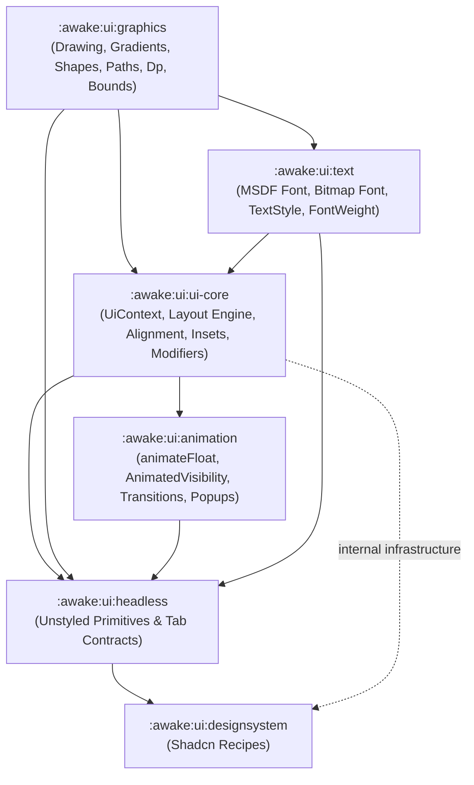

### Awake Graphical User Interface (GUI)

Awake UI is an immediate-mode UI framework for the Awake engine, modeled after modern declarative UI
architecture patterns (Jetpack Compose / Base UI).

### Module Architecture

The UI system is decomposed into focused, single-responsibility modules:

```kotlin
include(":awake:ui:graphics")
include(":awake:ui:text")
include(":awake:ui:animation")
include(":awake:ui:ui-core")
include(":awake:ui:headless")
include(":awake:ui:tailwind")
include(":awake:ui:designsystem")
include(":awake:ui:heroicons")
include(":awake:ui:testing")
include(":awake:ui:font-atlas-generator")
include(":awake:ui:tailwind-generator")
```

### Module Descriptions

- `awake:ui:graphics`:
    - Drawing primitives (`DrawPrimitive` / `UiDrawPrimitive`), shape painters, vector paths (
      `UiPath`, `UiImageVector`), linear/radial gradients (`Gradient` / `LinearGradient`), geometry
      bounds (`Bounds` / `UiBounds`), density (`Dp`, `Sp`, `UiDensity`), and icons (`UiIcon`).

- `awake:ui:text`:
    - SDF/MSDF font rendering (`MsdfFont`, `BitmapFont`, `PackedUiFont`), font atlas source
      integration (`GlyphAtlasSource`), typography styles (`TextStyle`), font weights (
      `FontWeight`), and text scale snapping.

- `awake:ui:animation`:
    - Frame-clock driven animation engine (`animateFloat`, `AnimatedVisibility`, `Transition`),
      layout transition scopes (`AnimatedLayoutScopes`), popup position providers (
      `UiPopupPositionProvider`), and shimmer sweep primitives (`ShimmerPrimitives`).

- `awake:ui:ui-core`:
    - Core frame loop, `UiContext` runtime state, layout engine (`Column`, `Row`, `Box`, `Spacer`,
      `LazyList`), layout sizing/padding (`Dimension`, `Alignment`, `Insets`), `UiModifier`, state
      hooks (`WidgetState`, `UiScrollState`), neutral theme/text local mechanics and fallback
      values (`UiThemeValues`, `CoreUiTheme`, `CoreUiComponentStyles`), and `UiPrimitiveScope`.
      Branded theme entry points belong in `designsystem`. (Retains `ui-core` to disambiguate
      from engine root `:awake:core`).

- `awake:ui:headless`:
    - Unstyled, accessible UI components (buttons, input fields, popups, accordions, tabs,
      `TabItem`, `TabScope`) for building custom design systems. Public leaf APIs receive generic
      `Style`; they do not expose branded or theme-provider APIs.

- `awake:ui:tailwind`:
    - Standalone Tailwind CSS design tokens (spacing, radius, color, typography scales).

- `awake:ui:designsystem`:
    - Styled component library following the [shadcn/ui](https://ui.shadcn.com/) design language,
      built on top of `headless` using `tailwind` tokens. It owns named themes and the lower-case
      `UiScope.shadcnTheme(...)` composition entry point.
      `ShadcnThemeExtension` provides root-scoped named-role customization; public recipes expose
      semantic options instead of a generic `Style` override. Use `shadcnThemeValues(...)` for an
      unscoped immutable theme value.

- `awake:ui:heroicons`:
    - Integration and vector path definitions for the Heroicons icon set.

- `awake:ui:testing`:
    - Utilities, snapshot test runners, and test harnesses for UI components.

- `awake:ui:font-atlas-generator`:
    - Tooling for generating signed distance field (MSDF/SDF) font atlases.

- `awake:ui:tailwind-generator`:
    - Tooling to generate UI styles and themes based on Tailwind CSS patterns.

### Dependency Flow



### Guide & Tools

- TODO: formalize our testing tool and remove stale/redundant ones?
- TODO: debug in frontend side using debugging wireframe or sheet
- TODO: tool to verify diff against official shadcn components styles, avoid using stale images,
  hardcoded tokens, must be dynamically retrieve from the source
- TODO: finalize which is the real source of truth for parity, currently i'm seeing screenshot of
  text in a wavy compare to the rendered one is already fixed
