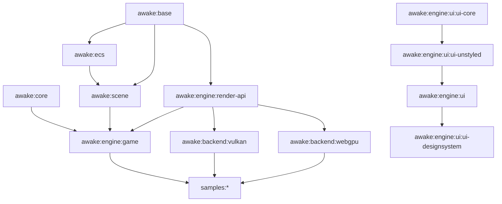

# Architecture

Awake is a Kotlin Multiplatform game engine library: a cross-platform graphics wrapper
(OpenGL working; Vulkan in progress) evolving toward a full KMP engine with ECS, a
Compose-style scene API, and a desktop editor.

## Read This With

- [docs/MVP_PLAN.md](/Users/ronvaldoz/StudioProjects/awaken/docs/MVP_PLAN.md) for the active roadmap
- [docs/tasks.md](/Users/ronvaldoz/StudioProjects/awaken/docs/tasks.md) for current work lanes
- [docs/reference/ui-ownership.md](/Users/ronvaldoz/StudioProjects/awaken/docs/reference/ui-ownership.md) for reusable UI boundaries
- [docs/reference/game-structure.md](/Users/ronvaldoz/StudioProjects/awaken/docs/reference/game-structure.md) for game state categories and folder ownership
- [docs/reference/ai-collaboration.md](/Users/ronvaldoz/StudioProjects/awaken/docs/reference/ai-collaboration.md) for agent-entrypoint and `skills/*` responsibilities

## Module Shape

## Module Graph

| Module | Purpose | Published |
|---|---|---|
| `:awake-base` | Dependency-free portable core: math, `Input`, `FixedTimestepLoop`, glTF parsing, bitmap/resource I/O | `awake-base` |
| `:awake-core` | Backend-agnostic app-lifecycle glue: `Application`, `GameLoop`, `VulkanView`, `EngineConfig` | `awake-core` |
| `:awake-opengl` | Legacy OpenGL rendering backend | `awake-opengl` |
| `:awake-ecs` | Sparse-set ECS runtime: entities, stores, queries, systems | `awake-ecs` |
| `:awake-scene` | Scene components and systems on top of ECS | `awake-scene` |
| `:awake-backend:vulkan` | Vulkan KMP bindings and JNI bridge | `awake-vulkan` |
| `:awake-engine:game` | Backend-neutral game bootstrap and runtime glue | not published |
| `:awake-engine:render-api` | Renderer-facing abstractions and draw orchestration | not published |
| `:awake-engine:ui:ui-core` | Foundational UI drawing and layout primitives | not published |
| `:awake-engine:ui:ui-unstyled` | Reusable widget-level primitives built on `ui-core` | not published |
| `:awake-engine:ui` | Style-agnostic UI composition templates and DSL surfaces | not published |
| `:awake-engine:ui:ui-designsystem` | Branded or strongly opinionated UI recipes | not published |
| `:samples:*` | Sample applications and demos | sample-only |

## Stable Rules

### Engine Boundaries

- Engine modules do not follow the app-style `:model/:api/:domain/:data/:presenter/:ui`
  clean-architecture split.
- Keep core engine layers API-agnostic: rendering internals stay out of generic runtime
  facades, and sample-only logic stays out of reusable engine modules.
- The common Vulkan API in `awake-backend:vulkan/src/commonMain` is the single source of truth.

### Generated And Native Code

- Do not hand-edit generated JNI Accessor/Mutator C++ files; regenerate them through the
  binding generator.
- Native-resource lifetime must remain symmetric: every create/allocation path needs the
  matching destroy/free path in the correct order.

### Resource Ownership

- A resource identical for every consumer of a backend or engine module belongs in that
  module's own `src/<sourceSet>/resources/`.
- Per-game content such as scenes, game shaders, textures, and authored assets stays in the
  consumer or sample module.
- If a Compose plugin packaging quirk forces a consumer-local duplicate for a backend shader,
  document the exception in a task note and keep the backend copy authoritative.

### Threading Model

- One thread owns every Vulkan call for a running app instance.
- `Application.update(delta)` is synchronous end-to-end on that owning thread.
- Desktop Vulkan runs on the main thread that created the window.
- Android Vulkan runs on its dedicated render thread, not the UI thread.
- Coroutines may help with IO and parsing, but must not touch Vulkan handles directly.

### Testing Posture

- GPU resource creation is not a useful target for fake-heavy app-style test doubles.
- Push parsing, packing, math, and protocol logic into small pure functions so those parts are
  straightforward to unit test.
- For visual Vulkan desktop paths, prefer headless pixel-baseline coverage when the path is
  testable.

### API Surface

- Never remove or rename public symbols in published modules without a major version bump.
- Public API changes to published modules require a changelog update.
- Keep internals `internal` unless they are intentional public surface.

## Validation Guardrails

- The Android Vulkan sample remains the regression gate for backend work.
- For rendering changes on desktop Vulkan, prefer headless pixel-baseline tests over manual
  screenshot-only verification when the path is testable.
