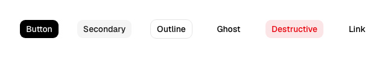
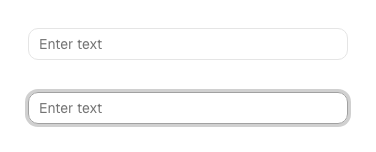

# Shadcn parity reference

Real, machine-readable ground truth for how close Awake's `ui-designsystem` components are
to actual shadcn/ui, pulled from `ronjunevaldoz/shadcn-compose`'s published
`docs/component-metadata.json` (schema: `docs/component-metadata.md` in that repo) instead of
memory or a hand-written "vibes" comparison. See
[`AwakeShadcnReferenceTokenTest`](../../awake/engine/ui-designsystem/src/commonTest/kotlin/io/github/ronjunevaldoz/awake/ui/designsystem/AwakeShadcnReferenceTokenTest.kt)
for the equivalent check on color *values* -- this doc is about variant/size *coverage* and
actual rendered look, which that test doesn't cover.

**Caveat the source itself calls out:** every preview image below was captured under
shadcn-compose's `Vega` style preset (1 of 8) with `baseColor = Neutral`, `accent = Base`.
Don't treat these as *the* canonical shadcn look -- they're *a* verified one. Swapping preset/
base color/accent changes shape, spacing, and animation on the real thing too.

This is not "100% accuracy" tooling and doesn't claim to be -- visual fidelity has no such
bar. It's a real reference image and a real property list, not a bullet-list of impressions.

## How to refresh this

```bash
curl -sL "https://raw.githubusercontent.com/ronjunevaldoz/shadcn-compose/main/docs/component-metadata.json" -o /tmp/shadcn-metadata.json
# re-run the download step in this doc's own history (git log this file) to see the exact script
```

## Full component inventory

The variant table below only covers components Awake already has. This section is the other
half: every component in shadcn-compose's own catalog
([`docs/components.md`](https://github.com/ronjunevaldoz/shadcn-compose/blob/main/docs/components.md)),
64 total, checked against what actually exists in `ui-designsystem`/`ui-dsl` today. ✓ means a
real, callable component exists (`awakeShadcn*` or a themed `ui-dsl` primitive) -- not "a
widget that could be styled to look similar."

### Core primitives (7)

| Component | Status |
|---|---|
| Button | ✓ `awakeShadcnButton` |
| Card | ✓ `awakeShadcnSurface(variant = Card)` |
| Badge | ✓ `awakeShadcnBadge` |
| Chip | ✗ |
| TextField | ✓ `awakeShadcnTextField` (built this session -- see gaps above) |
| Text | ✓ `awakeShadcnBodyText`/`Headline`/`SectionTitle`/`SupportingText` |
| Icon | ✓ `icon()` (ui-widgets, theme-agnostic; no shadcn-specific auto-tint wrapper) |

### Forms & inputs (12)

| Component | Status |
|---|---|
| Label | ✗ (inline labels only, via `propertyRow`'s `labelContent`) |
| Checkbox | ✓ `awakeShadcnCheckbox` |
| RadioGroup | ✗ |
| Switch | ✓ `awakeShadcnToggle` (this is shadcn's `Switch`, not its `Toggle` -- see below) |
| Toggle | ✗ (shadcn's pressable two-state button, e.g. bold/italic toolbar buttons -- a different component from Switch, we don't have it) |
| Slider | ✓ `awakeShadcnSlider` |
| ToggleGroup | ✗ |
| InputGroup | ✗ |
| ButtonGroup | ✗ |
| Textarea | ✗ |
| Field/FieldGroup | ~ partial (`propertyRow` gives label+control layout; no description/error-text slot) |
| InputOTP | ✗ |

### Data display (6)

| Component | Status |
|---|---|
| Avatar | ✗ |
| AspectRatio | ✗ |
| Separator | ✓ `separator()` (ui-widgets; no shadcn-specific style wrapper, but themeable via the caller) |
| Kbd | ✗ |
| Item/ItemGroup | ✗ |
| Empty | ✗ |

### Feedback (5)

| Component | Status |
|---|---|
| Alert | ✗ (only `alertDialog`, a modal -- no inline banner) |
| Progress | ✗ |
| Skeleton | ✗ |
| Spinner | ✗ |
| Toast/Toaster | ✗ |

### Disclosure & navigation (4)

| Component | Status |
|---|---|
| Collapsible | ✗ |
| Accordion | ✗ |
| Tabs | ✗ |
| Breadcrumb | ✗ |

### Overlays & navigation (15)

| Component | Status |
|---|---|
| Tooltip | ✓ `tooltip`/`tooltipText` (ui-dsl; caller supplies shadcn styling, no dedicated `awakeShadcnTooltip`) |
| Popover | ~ partial (`awakeShadcnSurface(variant = Popover)` is the surface building block; no anchored-trigger recipe) |
| HoverCard | ✗ |
| DropdownMenu | ✓ `dropdownMenu` (ui-dsl) |
| ContextMenu | ✗ |
| Dialog | ✓ `dialog` (ui-dsl) |
| AlertDialog | ✓ `alertDialog` (ui-dsl) |
| Sheet | ✗ |
| Drawer | ✗ |
| Combobox | ✗ |
| Select | ✓ `awakeShadcnDropdown` (non-searchable, matches real shadcn's plain Select) |
| Date Picker | ✗ |
| Command | ✗ |
| Menubar | ✗ |
| NavigationMenu | ✗ |

### Data & layout (8)

| Component | Status |
|---|---|
| Table | ✗ |
| Pagination | ✗ |
| ScrollArea | ✓ `awakeShadcnScrollSurface` |
| Chart | ✗ |
| Calendar | ✗ |
| Carousel | ✗ |
| ResizablePanelGroup | ✗ |
| Sidebar | ~ partial (the showcase app has its own sidebar composition; not a reusable `ui-designsystem` component) |

### AI Elements (5) and Utils (2)

Not evaluated -- chat/AI-assistant primitives (Message, Bubble, Attachment, Marker,
MessageScroller) and the shimmer/scroll-fade modifiers are a real part of shadcn-compose's
catalog but not something a game-engine UI layer has an obvious use for yet. Revisit if a
concrete use case shows up rather than building speculatively.

**Tally (57 evaluated, AI Elements/Utils excluded): 16 full ✓, 4 partial ~, 37 not built.**
That's the honest current state -- "shadcn-inspired design system" is still mostly a
core-primitives-and-overlays layer, not full coverage. Cross-reference this against
[`docs/tasks/2026-07-18-ui-showcase-cleanup.md`](../tasks/2026-07-18-ui-showcase-cleanup.md)'s
Phase 3 checklist before picking what to build next -- that task doc already sequences the
field/overlay/selection families; this inventory is what to consult when deciding what's
*not yet even on that list*.

## Variant/size coverage gaps

| Component | Real shadcn properties | Awake has | Gap |
|---|---|---|---|
| `button` | `ButtonVariant`: Default, Outline, Secondary, Ghost, Destructive, Link; `ButtonSize`: Xs, Sm, Md, Lg, Icon | `AwakeShadcnButtonVariant`: Primary, Secondary, Outline, Ghost, Danger, **Link** (added) | Still no `ButtonSize` equivalent -- every call site hardcodes its own px width/height. |
| `badge` | `BadgeVariant`: Default, Secondary, Destructive, Outline, Ghost | `AwakeShadcnBadgeVariant`: Primary, Secondary, Outline, Danger, **Ghost** (added) | Closed. |
| `text-field` | `TextFieldVariant`: Default, Filled, Ghost | `textField()`/`awakeShadcnTextField()`: **error/invalid and disabled states added** (red border + helper text row, muted disabled look); still no Filled/Ghost variant | Filled/Ghost variants still missing -- error/disabled (the higher-value gap) closed. |
| `select` | `SelectVariant`: Default | `awakeShadcnDropdown()`: no variant axis | Matches (both effectively single-variant). |
| `checkbox` / `switch` / `slider` / `tabs` / `tooltip` / `popover` / `dropdown-menu` / `dialog` / `alert-dialog` | No variant axis in the real component either | Matches | No gap -- these are correctly single-look on both sides. |
| `toggle` | `ToggleVariant`: Default, Outline | We have no separate "Toggle" component from "Switch" -- Awake's `toggle()` is the switch equivalent; a bordered-button-style toggle (shadcn's actual `Toggle`, a different component from `Switch`) doesn't exist here. | Not a gap in the switch we have -- a genuinely separate missing *component* (icon/text toggle-button, not a boolean switch). |

## Visual notes (actually looked at the reference image, not just the property list)

**`button_variants_light.png`** (): real shadcn's `Default` variant is solid near-black, `Secondary` is a pale gray fill, `Outline` is a bordered/transparent button, `Ghost` is no fill/no border (label only), `Destructive` is solid red, `Link` renders as plain underlined-style text with no button chrome at all. Confirms our `Primary`/`Secondary`/`Outline`/`Ghost`/`Danger` five already track this correctly by color role (checked against [`AwakeShadcnReferenceTokenTest`](../../awake/engine/ui-designsystem/src/commonTest/kotlin/io/github/ronjunevaldoz/awake/ui/designsystem/AwakeShadcnReferenceTokenTest.kt)'s primary/destructive values); `Link` is the one real look we don't have a variant for.

**`text-field_states_light.png`** (): five states shown -- `Default` (bordered, transparent bg), `Filled` (gray fill, no border), `Ghost` (no border/no fill, just a label), an **invalid/error state** (red border + red helper text below the field), and `Disabled` (muted gray, reduced contrast). Awake's `textField()` (built this session) only has the `Default` look -- no `Filled`/`Ghost` variant, no error/invalid state with helper text, no disabled state. This is the most substantive real gap this doc found: error-state styling on a form field is a genuinely common need, not a nice-to-have.

The other 12 downloaded images (`badge`, `checkbox`, `switch`, `slider`, `tabs`, `tooltip`,
`popover`, `dropdown-menu`, `select`, `dialog`, `alert-dialog`) are checked into
[`shadcn-previews/`](shadcn-previews/) for reference but haven't been individually eyeballed
and written up yet -- do that the same way before building or revising each of those
components, not all at once up front.

## Recommended next steps, in priority order

1. ~~Add `textField()`'s missing states~~ -- done: `enabled`/`isError` on `textField()` and
   `awakeShadcnTextField()`, `errorText` on `awakeShadcnPropertyTextField()`. Verified visually
   against `docs/reference/awake-previews/awake-textfield-states-light.png`.
2. ~~Add a `Link` button variant~~ -- done: `AwakeShadcnButtonVariant.Link`. Verified visually
   against `docs/reference/awake-previews/awake-button-variants-light.png`.
3. ~~Add a `Ghost` badge variant~~ -- done: `AwakeShadcnBadgeVariant.Ghost`. Not yet verified
   against a screenshot (no badge parity preview exists yet -- add one before trusting this
   blindly).
4. Still open: `ButtonSize` axis (Xs/Sm/Md/Lg/Icon), `textField()`'s `Filled`/`Ghost`
   variants.
5. When building the still-missing components from
   [`docs/tasks/2026-07-18-ui-showcase-cleanup.md`](../tasks/2026-07-18-ui-showcase-cleanup.md)'s
   Phase 3 checklist (textarea, select variants, popover, tabs, radio group, etc), pull that
   component's real preview image from `component-metadata.json` first and look at it before
   writing the recipe -- not after, as a retrofit.
