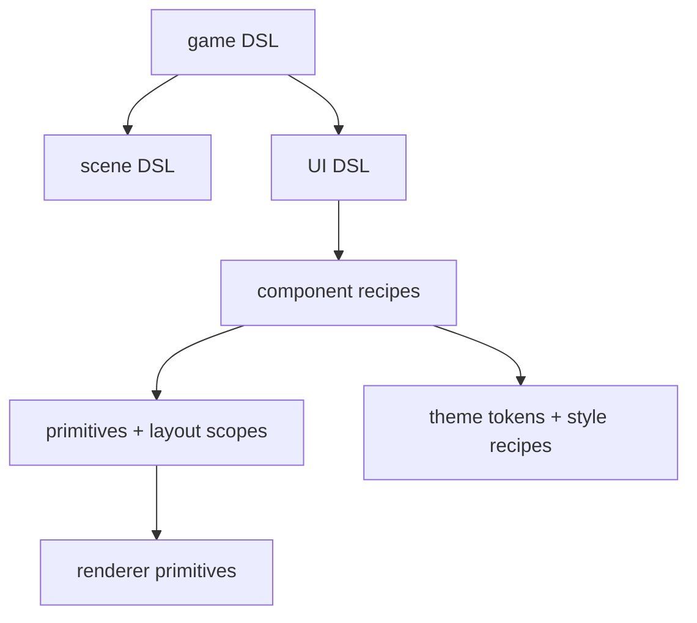

# 2026-07-14: UI DSL and Style Audit

## Goal

Fix the bitmap text noise in the sample UI, then define a cleaner path toward reusable
Awake UI primitives, component recipes, and DSL layers for game, scene, and UI authoring.

## Result

- Snapped bitmap text rendering to whole-number scale steps via `pixelPerfectTextScale()`
  so retro-font glyphs stay stable instead of expanding unevenly at fractional scales.
- Switched the glyph atlas samplers to explicit nearest filtering in both Vulkan and
  WebGPU, which keeps the 8x8 atlas crisp instead of letting generic texture defaults
  soften it.
- Aligned the hello-cube sample to a 2x text scale so the demo constants match the new
  bitmap-text behavior.

## Audit Findings

### 1. `UiContext` is still the central bucket

`UiContext` currently owns frame state, input routing, widget-local state, primitive
staging, overlay ordering, and clip-stack resolution. That works for a small immediate-mode
UI, but it is too much authority in one class if Awake wants a richer UI surface.

### 2. `Widgets.kt` is carrying too many roles

Buttons, toggles, checkboxes, sliders, dropdowns, text, property rows, panel helpers, and
paint utilities all live together. The API is usable, but it is not yet shaped as reusable
primitives plus component recipes.

### 3. `UiStyle` is only a color callback

Today the style seam is:

- widget state in
- one fill color out

That is enough for hover/active tinting, but not for a shadcn-compose-like style API where
component recipes also own padding, border, radius, typography, and slot treatment.

### 4. `UiModifier` is structural, not expressive

`UiModifier` has the right spirit, but it currently covers size, corner radius, and border
only. That makes it useful for layout and shape overrides, not yet for a real style system.

### 5. Sample UI constants are duplicated

`CubeDemo` and `DemoCatalog` both own text-scale and spacing constants. That duplication is
small, but it points to a missing metrics/typography layer for engine-owned UI.

## Recommended Target Shape



### 1. Keep primitives small and public

The current `UiScope` idea is solid. Keep the low-level surface public:

- layout scopes
- slot claiming
- hit testing
- primitive emission
- clipping

This is the layer custom widgets should build on.

### 2. Split widgets into primitives and recipes

Break `Widgets.kt` into smaller files:

- `Text.kt`
- `Button.kt`
- `Toggle.kt`
- `Checkbox.kt`
- `Slider.kt`
- `Dropdown.kt`
- `Panel.kt`
- `PropertyRow.kt`
- `Paint.kt`

That keeps behavior local and makes future style recipes easier to evolve.

### 3. Grow `UiStyle` into component recipes

Introduce component-level recipe types instead of one generic color callback:

- `ButtonStyle`
- `CheckboxStyle`
- `SliderStyle`
- `DropdownStyle`
- `PanelStyle`
- `FieldStyle`
- `TextStyle`

Each recipe should own:

- container/background treatment
- border and corner radius
- padding and spacing
- text color and text scale
- variant-specific defaults

`UiModifier` should stay mostly structural while style recipes own the visual defaults.

### 4. Add a real theme object

Keep color tokens, but add metrics and component defaults:

- `UiColorTokens`
- `UiTypographyTokens`
- `UiSpacingTokens`
- `UiShapeTokens`
- `UiComponentStyles`

That gives Awake the same kind of "set once, consume everywhere" styling story that makes
shadcn-compose pleasant to build with.

### 5. Build the DSL in layers

#### Game DSL

High-level app composition:

```kotlin
game {
    window(title = "Awake")
    scene("cube") { mainScene() }
    ui { debugHud() }
}
```

#### Scene DSL

Author runtime scenes without leaking raw ECS plumbing:

```kotlin
scene {
    entity("camera") {
        transform { position(0f, 2f, 8f) }
        camera { perspective() }
    }
    entity("cube") {
        transform { position(0f, 0f, 0f) }
        meshRenderer("cube")
    }
}
```

#### UI DSL

Expose composed components instead of direct primitive soup:

```kotlin
panel {
    section("Camera") {
        select("Mode", cameraModes, selectedMode)
        slider("Azimuth", orbitYaw, -PI.toFloat(), PI.toFloat())
        checkbox("Grid", showGrid)
    }
}
```

The important part is that these DSL calls stay thin wrappers over reusable component
recipes, not another monolith.

## Suggested Order

1. Split `Widgets.kt` into focused files with no behavior change.
2. Add `UiTypographyTokens`, `UiSpacingTokens`, and `UiComponentStyles`.
3. Replace generic `UiStyle` usage on the main widgets with component recipes.
4. Introduce a small `Field`/`Section` surface for inspector-style layouts.
5. Add the first public UI DSL layer on top of those recipes.
6. Add game and scene DSLs only after the UI recipe layer is stable.

## Guardrails

- Keep the immediate-mode renderer path; the DSL should compile down to today's staged
  primitives, not replace the renderer model.
- Do not move scene/runtime concerns into `awake:engine:ui`.
- Keep custom game components outside `awake:ecs`; the ECS module should stay library-like.
- Prefer design-token and recipe seams before adding more widget parameters.

## Validation

- `:awake:engine:ui:allTests`
- hello-cube sample run on Vulkan
- hello-cube sample run on WebGPU

## Done When

- Awake UI has a real theme + component-style layer, not only color callbacks.
- Engine widgets are split into reusable files with clearer ownership.
- The first public game/scene/UI DSL calls read declaratively without hiding runtime cost.
